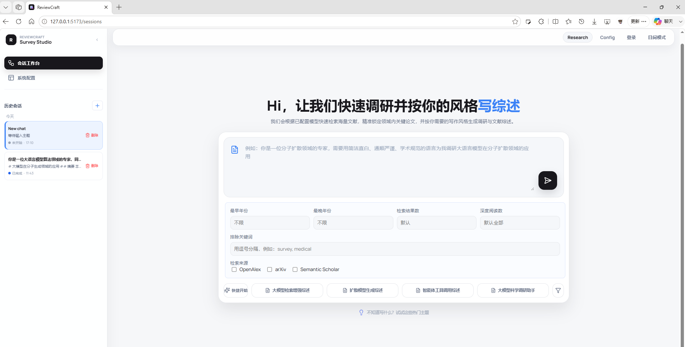
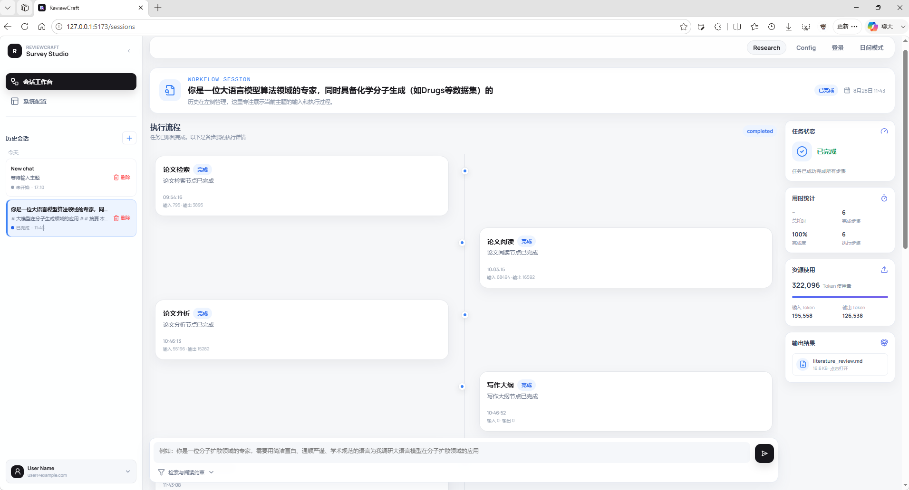

<div align="center">

# ReviewCraft

**按你的写作风格，快速完成领域调研与文献综述。**

输入研究主题和写作要求，ReviewCraft 会根据已配置模型快速检索海量文献，精准锁定领域内关键论文，并按用户需要的表达风格生成调研结果与文献综述。检索、阅读、分析、写作、引用与 token 使用情况都会保存在同一个会话中，方便回看和继续修改。

[](https://www.python.org/)
[](https://fastapi.tiangolo.com/)
[](https://vuejs.org/)
[](https://langchain-ai.github.io/langgraph/)
[](https://docs.astral.sh/uv/)

</div>

<p align="center">
  
  <br>
  <em>图 1：在会话工作台输入研究主题，并配置年份、来源、结果数量和精读篇数。</em>
</p>

<p align="center">
  <a href="#reviewcraft-是什么"><strong>项目介绍</strong></a> &middot;
  <a href="#核心特色"><strong>核心特色</strong></a> &middot;
  <a href="#评估指标"><strong>评估指标</strong></a> &middot;
  <a href="#快速开始"><strong>快速开始</strong></a>
</p>

---

## ReviewCraft 是什么

ReviewCraft 是一个面向文献综述场景的本地科研 Agent 系统。它把一次调研拆成清晰流程：生成检索计划，多来源检索论文，筛选摘要与全文，提取关键证据，组织大纲，最后按证据和用户风格写作。

当前版本重点强化三项能力：

- **Self-RELOOP 检索修正**：第一次 retrieval 判 FAIL 时，根据失败原因改写 query 并重新检索。
- **OpenScholar 风格评估**：用 rubric correctness、citation precision/F1、coverage、relevance、organization 和 cost 衡量综述质量。
- **长期记忆与上下文压缩**：跨 session 记住用户写作规则和对话规范，同时压缩论文 JSON 字段，降低长上下文与 API 503 风险。

<p align="center">
  
  <br>
  <em>图 2：任务结束后仍可查看检索、阅读、分析、写作和 token 使用情况。</em>
</p>

## 核心特色

| 能力 | 说明 |
| --- | --- |
| 多智能体调研流程 | `SearchAgent` 生成检索计划，`ReadAgent` 精读论文，`AnalyseAgent` 汇总研究现状，`WritingOutlineAgent` 组织大纲，`WritingAgent` 按证据写作。 |
| 多来源论文检索 | 支持 arXiv、OpenAlex、Semantic Scholar，并统一为 `PaperDocument` 进入排序、去重、阅读和引用检查流程。 |
| Self-RELOOP | 记录首轮检索失败原因，例如结果太少、主题偏移或证据不足；改写 query 后再次检索，并用修正成功率和相关性增益评估效果。 |
| 长期记忆 | `src/services/memory.py` 以轻量规则保存用户偏好、对话规则、风格规范和最近任务摘要。 |
| 上下文压缩 | 只把当前请求、写作规则、关键证据和短摘要交给后续 Agent，避免把全文片段和重复 JSON 全塞进上下文。 |
| 前后端工作台 | FastAPI 提供 REST/SSE，本地 Vue 工作台展示会话、运行进度、产物和系统配置。 |

## 评估指标

ReviewCraft 的评估参考 OpenScholar 的指标口径，重点检查综述是否正确、证据是否支撑结论、结构是否清楚，以及检索修正是否真的带来收益。

| 指标 | 定义 |
| --- | --- |
| Rubric Correctness | `Score = 0.6 * S_expert ingredients + 0.4 * S_general criteria`。专家要点衡量领域关键事实与方法是否正确，通用标准衡量回答是否满足题目要求。 |
| Citation Precision / F1 | 检查每个需要引用文献的 scientific claim 是否有 citation；再检查给出的 citation 是否真的支持该 claim，以及该 citation 是否必要。 |
| Coverage | LLM-as-Judge 判断综述是否覆盖关键方向、代表性论文、主要方法和重要发现。 |
| Relevance | LLM-as-Judge 判断正文是否始终围绕用户主题，避免检索相关但写作跑题。 |
| Organization | LLM-as-Judge 判断章节结构、段落顺序、论证链和过渡是否清楚。 |
| Cost | 统计输入 token、输出 token 和总 token，用于比较不同模型与流程配置的成本。 |
| Correction Success Rate | 在第一次 retrieval 判 FAIL 的 query 中，统计经过 Self-RELOOP 后转为 PASS 的比例。 |
| Relevance Gain | 对比修正前后的 reader relevance score，直接计算相关性提升幅度。 |

## 记忆与上下文压缩

生成综述前，多 Agent 流程会注入与当前任务相关的长期记忆：用户跨 session 留下的对话规则、写作规范、偏好和风格约束。当前会话里的角色、语气、格式要求只约束本轮写作，不写入长期记忆。

论文检索和精读阶段会产生大量摘要、方法、实验结果和局限信息。ReviewCraft 只把当前请求、写作规则、短摘要和关键证据交给后续 Agent，减少重复上下文，降低长上下文带来的失败风险。

## 技术栈

| 层级 | 技术选型 |
| --- | --- |
| 运行时 | Python 3.12+、`uv`、Uvicorn |
| 后端 API | FastAPI、REST、Server-Sent Events |
| 工作流 | LangGraph、TypedDict 共享状态 |
| Agent | Search、Read、Analyse、Writing Outline、Writing |
| LLM 适配 | OpenAI 兼容协议、Anthropic Messages 协议 |
| 论文来源 | arXiv、OpenAlex、Semantic Scholar |
| 全文处理 | `pypdf`、文本清洗、文本分块 |
| 向量检索 | ChromaDB + OpenAI-compatible embedding |
| 会话存储 | SQLite + 本地 JSON / Markdown / 向量数据 |
| 前端 | Vue 3、TypeScript、Vite、Vue Router、Lucide |

## 项目结构

```text
paper-agent-main/
├── main.py                         # FastAPI 本地启动入口
├── graph.py                        # 工作流兼容入口
├── pyproject.toml                  # Python 依赖
├── package.json                    # 前端快捷命令
├── assets/
│   └── readme/                     # README 图 1 和图 2
├── config/
│   ├── model.example.json          # 模型配置示例
│   ├── model.json                  # 本地模型配置
│   └── system.yaml                 # 默认 token、embedding 和检索参数
├── data/
│   ├── memory/                     # 跨 session 用户记忆
│   ├── paper_cache/                # 论文全文缓存
│   ├── sessions/                   # 会话产物
│   └── session_store.db            # 本地会话数据库
├── front/                          # Vue 3 + TypeScript 前端
│   ├── src/api/                    # 会话与设置 API 客户端
│   ├── src/components/             # 工作台、状态和会话组件
│   └── src/views/                  # 会话工作台与系统设置页
├── scripts/
│   └── local_embedding_server.py   # 本地 OpenAI-compatible embedding 服务
├── src/
│   ├── agents/                     # 各节点 Agent 与 prompts
│   ├── api/                        # FastAPI 应用与路由
│   ├── graph/                      # LangGraph 主流程和阶段节点
│   ├── llm/                        # Provider 适配与统一响应
│   ├── models/                     # 会话、协议和阅读模型
│   ├── paper_retrieval/            # 论文模型、检索服务和来源连接器
│   ├── repositories/               # SQLite、JSON、Chroma 持久化
│   ├── services/                   # 会话、运行、设置、记忆和工作流服务
│   └── utils/                      # 日志、缓存、全文解析和分块工具
└── test/                           # unittest 测试与联调辅助代码
```

## 快速开始

ReviewCraft 需要一个 embedding 模型用于论文向量化和相关性检索。项目内置的本地服务使用 `Qwen/Qwen3-Embedding-0.6B`，原生维度为 `1024`；OpenAI-compatible 请求可传 `dimensions`，本地服务支持 `1-1024` 的截断维度，默认建议使用 `1024` 或配置里的 `null`。

### 1. 安装依赖

```powershell
uv venv --python 3.12
uv sync
npm run front:install
```

### 2. 配置模型

复制示例配置后，在 Web 工作台「系统配置」页面填写并测试模型：

```powershell
Copy-Item config/model.example.json config/model.json
```

至少确认：

- `providers` 中有可用的聊天模型 Provider。
- `agents.default_agent`、`agents.luna_agent`、`agents.solar_agent` 已指向可用模型。
- `embedding_profiles.default_embedding` 已指向可用 embedding Provider。
- 使用本地 embedding 服务时，embedding Provider 的 `api_base` 指向 `http://127.0.0.1:8001/v1`。

### 3. 启动服务

需要开三个终端窗口。

终端 1：启动本地 embedding 服务。

```powershell
cd your project
.\.embedding-venv\Scripts\python.exe scripts\local_embedding_server.py --host 127.0.0.1 --port 8001
```

终端 2：启动后端。

```powershell
cd your project
uv run python main.py
```

后端默认监听 `127.0.0.1:8000`，API 文档见 <http://127.0.0.1:8000/docs>。

终端 3：启动前端。

```powershell
cd your project
npm run front:dev
```

打开 <http://127.0.0.1:5173/>，先进入「系统配置」测试模型，再回到会话工作台创建调研任务。

### 4. 评估 Paper Agent

`--variants` 控制是否启用检索自我检查：`without_loop` 不启用，`with_loop` 启用。

```powershell
uv run python scripts/evaluate_scholarqa_cs.py `
  --limit 3 `
  --variants with_loop `
  --sources openalex arxiv `
  --max-results 8 `
  --deep-read-limit 5 `
  --save-state `
  --agent-timeout-seconds 3600 `
  --agent-provider-timeout-seconds 300 `
  --agent-provider-max-retries 2 `
  --judge-provider deepseek `
  --judge-api-base https://api.deepseek.com `
  --judge-model deepseek-v4-pro `
  --judge-timeout-seconds 600 `
  --judge-max-retries 3 `
  --judge-answer-char-limit 16000 `
  --judge-evidence-char-limit 10000 `
  --judge-max-tokens 2048
```

####  只重跑 Markdown 指标评估

用于跳过 agent，只对已经生成的 Markdown 文献综述重新执行 LLM judge。

```powershell
.\.venv\Scripts\python.exe scripts\evaluate_scholarqa_cs.py `
  --case-id d44280651a6fb71d56ee96834e180fa6 `
  --variants without_loop `
  --run-dir data\evaluation\scholarqa_cs\XXX `
  --eval-only-state data\evaluation\scholarqa_cs\XXX\states\*__without_loop.json `
  --eval-only-answer data\evaluation\scholarqa_cs\XXX\answers\*__without_loop.md
```

#### openscholar-cs数据集指标对比

| 指标组         | 指标                      | without_loop | with_loop |
| -------------- | ------------------------- | -----------: | --------: |
| 运行成本       | total_tokens              |         195k |      400k |
| 运行成本       | cost                      |    约 2.5 元 | 约 4.0 元 |
| 检索/阅读      | read_results.paper_count  |            8 |      8-10 |
| 检索/阅读      | read_relevance.mean_score |         3.75 |      20.0 |
| 自检修复       | correction_success        |        false |      true |
| 自检修复       | repair_attempt_count      |            0 |         1 |
| LLM judge 评分 | weighted_correctness      |         0.10 |      0.76 |
| LLM judge 评分 | expert_ingredients_score  |         0.15 |      0.62 |
| LLM judge 评分 | general_criteria_score    |         0.05 |      0.52 |
| LLM judge 评分 | citation_f1               |         0.15 |      0.59 |
| LLM judge 评分 | coverage                  |            1 |         4 |
| LLM judge 评分 | relevance                 |            1 |         4 |
| LLM judge 评分 | organization              |            2 |         3 |

## 模型配置

每个 Agent 可以使用不同模型档位：

| Agent | 默认档位 | 主要职责 |
| --- | --- | --- |
| `SearchAgent` | `luna_agent` | 生成关键词、子主题和检索约束 |
| `ReadAgent` | `default_agent` | 阅读摘要，判断相关性并整理笔记 |
| `AnalyseAgent` | `solar_agent` | 分析子主题，综合研究现状与趋势 |
| `WritingOutlineAgent` | `default_agent` | 生成正文大纲和证据映射 |
| `WritingAgent` | `default_agent` | 逐节写作、调用资料工具和审查修改 |

支持的 Provider 后端包括 `openai`、`openai_compat`、`anthropic`、`anthropic_compat`。

---

<div align="center">

**快速调研，按你的风格写综述。**

</div>
